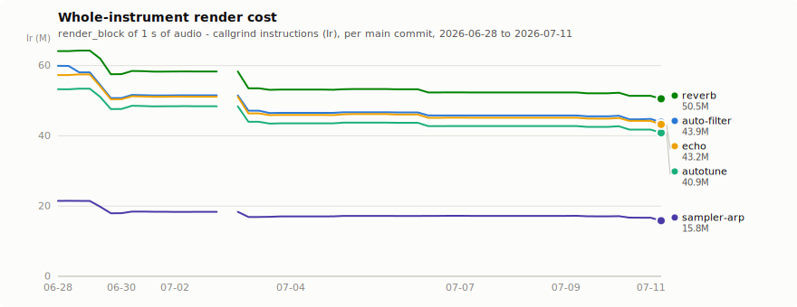
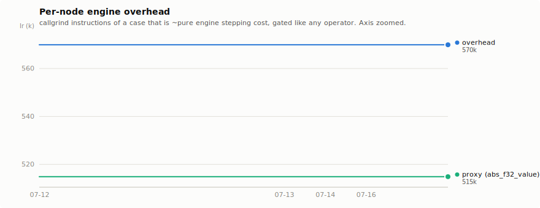
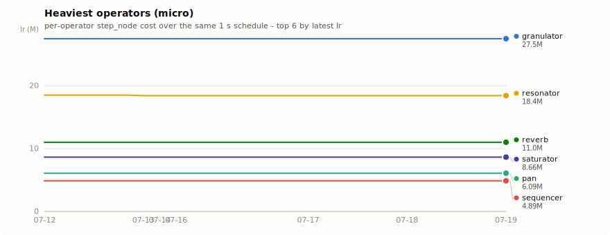

# reuben bench history

Deterministic CI performance trend ([ADR-0019]): callgrind **instruction counts (Ir)** for rendering **1 s of audio** (375 × 128-frame blocks @ 48 kHz), recorded on every direct push to `main`. Instruction counts don't jitter — every visible move is a real code change (or a toolchain bump).

**49 commits** · 2026-06-28 → 2026-07-09 · 2838 data points · last: `6c29d4a` (2026-07-09T07:26:52-04:00)

*This page is regenerated by CI on every append — see `.github/scripts/bench-dashboard.py` on `main`. Raw series: [`bench-history.jsonl`](./bench-history.jsonl).*

## Whole-instrument render (macro)

<picture>
  <source media="(prefers-color-scheme: dark)" srcset="charts/macro-dark.svg">
  
</picture>

| Instrument | Latest Ir | vs prev | vs first | since |
|---|---:|---:|---:|---|
| `auto-filter` | 45.8M | ±0.0% | **-23.6%** | 2026-06-28 |
| `autotune` | 42.8M | ±0.0% | **-19.7%** | 2026-06-28 |
| `echo` | 45.2M | ±0.0% | **-21.2%** | 2026-06-28 |
| `reverb` | 52.3M | ±0.0% | **-18.4%** | 2026-06-28 |
| `sampler-arp` | 17.2M | ±0.0% | **-19.9%** | 2026-06-28 |

## Per-node engine overhead

<picture>
  <source media="(prefers-color-scheme: dark)" srcset="charts/overhead-dark.svg">
  
</picture>

`overhead` is a bench-only no-op operator behind a typical port shape, so its entire cost is the engine's per-node stepping overhead (edge clear, routing, materialize, `Io` build — see `bench_support.rs`). The `proxy (abs_f32_value)` line is the cheapest value-rate case — ~99% the same overhead — covering history from before the dedicated case landed; its level differs (a smaller port surface), so the two are separate lines, never stitched. Latest: **684k Ir** ≈ **1,823 instructions per node per block**. This overhead is a constant offset on every micro case and scales with node count in an instrument.

## Heaviest operators (micro)

<picture>
  <source media="(prefers-color-scheme: dark)" srcset="charts/micro-heavy-dark.svg">
  
</picture>

## All cases

Full table — every benched case, latest vs previous and first recording

| Case | Latest Ir | vs prev | vs first | since |
|---|---:|---:|---:|---|
| `macro/auto-filter` | 45.8M | ±0.0% | **-23.6%** | 2026-06-28 |
| `macro/autotune` | 42.8M | ±0.0% | **-19.7%** | 2026-06-28 |
| `macro/echo` | 45.2M | ±0.0% | **-21.2%** | 2026-06-28 |
| `macro/reverb` | 52.3M | ±0.0% | **-18.4%** | 2026-06-28 |
| `macro/sampler-arp` | 17.2M | ±0.0% | **-19.9%** | 2026-06-28 |
| `granulator` | 28.5M | ±0.0% | +0.1% | 2026-06-30 |
| `resonator` | 18.6M | ±0.0% | **-21.6%** | 2026-06-29 |
| `reverb` | 11.1M | ±0.0% | **-11.7%** | 2026-06-28 |
| `pan` | 6.20M | ±0.0% | **-8.2%** | 2026-06-28 |
| `sequencer` | 5.11M | ±0.0% | **+3.9%** | 2026-06-28 |
| `map_f32_signal` | 4.69M | ±0.0% | -0.6% | 2026-06-28 |
| `euclid` | 4.33M | ±0.0% | +1.8% | 2026-06-28 |
| `modulo_f32_signal` | 4.17M | ±0.0% | **-3.0%** | 2026-06-28 |
| `delay` | 3.97M | ±0.0% | **-31.4%** | 2026-06-28 |
| `sample` | 3.76M | ±0.0% | **-12.0%** | 2026-06-28 |
| `power_f32_signal` | 3.64M | ±0.0% | +1.7% | 2026-06-28 |
| `clock` | 3.25M | ±0.0% | **-26.2%** | 2026-06-28 |
| `lfo` | 3.18M | ±0.0% | **-52.9%** | 2026-06-28 |
| `clamp_f32_signal` | 2.90M | ±0.0% | -1.2% | 2026-06-28 |
| `oscillator` | 2.76M | ±0.0% | **-34.9%** | 2026-06-28 |
| `djfilter` | 2.44M | ±0.0% | **-31.7%** | 2026-06-28 |
| `envelope` | 1.85M | ±0.0% | **-11.7%** | 2026-06-28 |
| `filter` | 1.78M | ±0.0% | **-31.0%** | 2026-06-28 |
| `div_f32_signal` | 1.77M | ±0.0% | **-20.8%** | 2026-06-28 |
| `noise` | 1.66M | ±0.0% | +0.2% | 2026-06-28 |
| `strum` | 1.56M | ±0.0% | +2.8% | 2026-06-28 |
| `add_f32_signal` | 1.53M | ±0.0% | **-21.4%** | 2026-06-28 |
| `max_f32_signal` | 1.53M | ±0.0% | **-23.4%** | 2026-06-28 |
| `min_f32_signal` | 1.53M | ±0.0% | **-23.4%** | 2026-06-28 |
| `mul_f32_signal` | 1.53M | ±0.0% | **-23.3%** | 2026-06-28 |
| `sub_f32_signal` | 1.53M | ±0.0% | **-21.4%** | 2026-06-28 |
| `m2s` | 1.21M | ±0.0% | ±0.0% | 2026-06-28 |
| `integrate_f32_signal` | 1.15M | ±0.0% | **-3.0%** | 2026-06-28 |
| `harmony` | 922k | ±0.0% | **-18.0%** | 2026-06-28 |
| `differentiate_f32_signal` | 901k | ±0.0% | **-30.4%** | 2026-06-28 |
| `abs_f32_signal` | 857k | ±0.0% | **-27.6%** | 2026-06-28 |
| `negate_f32_signal` | 857k | ±0.0% | **-27.6%** | 2026-06-28 |
| `reciprocal_f32_signal` | 813k | ±0.0% | **-42.9%** | 2026-06-28 |
| `output` | 749k | ±0.0% | **-34.1%** | 2026-06-28 |
| `map_f32_value` | 747k | ±0.0% | **+7.4%** | 2026-06-28 |
| `voicer` | 722k | ±0.0% | **+9.0%** | 2026-06-28 |
| `overhead` | 684k | ±0.0% | +1.7% | 2026-07-05 |
| `clamp_f32_value` | 679k | ±0.0% | **+8.1%** | 2026-06-28 |
| `modulo_f32_value` | 672k | ±0.0% | **+7.8%** | 2026-06-28 |
| `power_f32_value` | 667k | ±0.0% | **+8.3%** | 2026-06-28 |
| `div_f32_value` | 658k | ±0.0% | **+8.3%** | 2026-06-28 |
| `add_f32_value` | 657k | ±0.0% | **+8.4%** | 2026-06-28 |
| `max_f32_value` | 657k | ±0.0% | **+8.4%** | 2026-06-28 |
| `min_f32_value` | 657k | ±0.0% | **+8.4%** | 2026-06-28 |
| `mul_f32_value` | 657k | ±0.0% | **+8.4%** | 2026-06-28 |
| `sub_f32_value` | 657k | ±0.0% | **+8.4%** | 2026-06-28 |
| `snap` | 644k | ±0.0% | **+8.3%** | 2026-06-28 |
| `reciprocal_f32_value` | 637k | ±0.0% | **+8.7%** | 2026-06-28 |
| `abs_f32_value` | 636k | ±0.0% | **+8.8%** | 2026-06-28 |
| `negate_f32_value` | 636k | ±0.0% | **+8.8%** | 2026-06-28 |
| `transpose` | 622k | ±0.0% | **+9.6%** | 2026-06-28 |
| `chord` | 611k | ±0.0% | **+7.9%** | 2026-06-28 |
| `osc_out` | 563k | ±0.0% | **+7.6%** | 2026-06-28 |
| `subpatch` | 530k | ±0.0% | **+3.2%** | 2026-07-01 |

## Reading notes

- **Bold** deltas exceed the perf gate's 3% warn line ([ADR-0019]).
- Micro cases measure `step_node` — operator DSP **plus** the constant per-node engine overhead above. Cheap (value-rate) cases are therefore dominated by that overhead: a uniform absolute shift across all of them is an engine-overhead change, not operator regressions.
- A series that starts mid-chart is an operator that landed after recording began; its *vs first* compares against its own first real measurement (registration stubs < 1000 Ir are dropped).
- Gaps are honest: a commit whose bench harness didn't compile against its baseline records nothing.
- Ir is not wall-clock. Counts shift when the pinned toolchain or target baseline changes (e.g. the x86-64-v3 bump on 2026-06-29) — those steps are real cost changes on the same workload, but not source-code regressions/wins.

[ADR-0019]: https://github.com/Impractical-Instruments/reuben/blob/main/docs/adr/0019-performance-benchmarking.md
