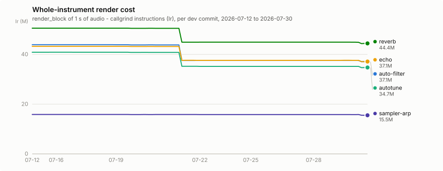
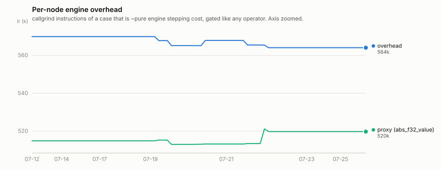
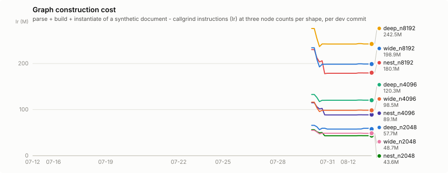
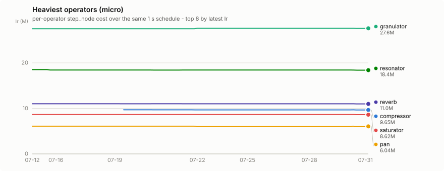
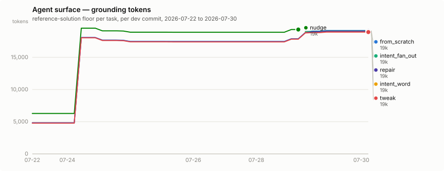
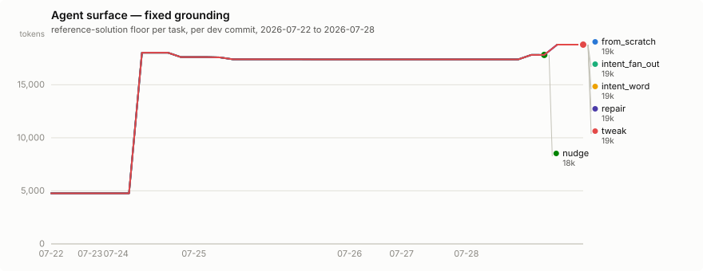
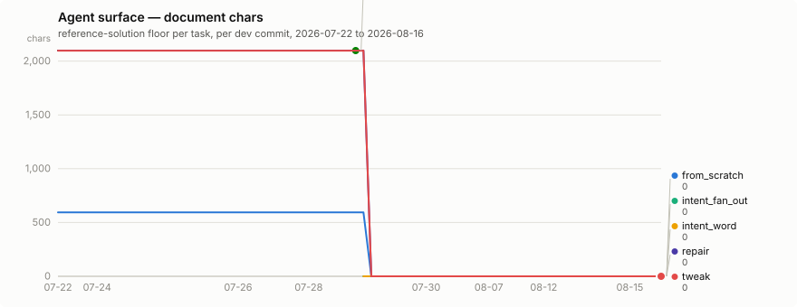

# reuben bench history — dev

Deterministic CI performance trend: callgrind **instruction counts (Ir)** for rendering **1 s of audio** (375 × 128-frame blocks @ 48 kHz), recorded on every direct push to `dev`. Instruction counts don't jitter — every visible move is a real code change (or a toolchain bump).

**110 commits** · 2026-07-12 → 2026-07-30 · 8097 data points · last: `db38ef3` (2026-07-30T21:03:51-04:00)

*Companion trend: the **main** series lives on the [`bench-history`](https://github.com/Impractical-Instruments/reuben/tree/bench-history) branch.*

*This page is regenerated by CI on every append — see `.github/scripts/bench-dashboard.py` on `main`. Raw series: [`bench-history.jsonl`](./bench-history.jsonl).*

## Whole-instrument render (macro)

<picture>
  <source media="(prefers-color-scheme: dark)" srcset="charts/macro-dark.svg">
  
</picture>

| Instrument | Latest Ir | vs prev | vs first | since |
|---|---:|---:|---:|---|
| `auto-filter` | 37.6M | ±0.0% | **-14.4%** | 2026-07-12 |
| `autotune` | 35.2M | ±0.0% | **-13.9%** | 2026-07-12 |
| `echo` | 37.6M | ±0.0% | **-13.0%** | 2026-07-12 |
| `reverb` | 44.9M | -0.1% | **-11.3%** | 2026-07-12 |
| `sampler-arp` | 15.8M | +0.2% | -0.1% | 2026-07-12 |

## Per-node engine overhead

<picture>
  <source media="(prefers-color-scheme: dark)" srcset="charts/overhead-dark.svg">
  
</picture>

`overhead` is a bench-only no-op operator behind a typical port shape, so its entire cost is the engine's per-node stepping overhead (edge clear, routing, materialize, `Io` build — see `bench_support.rs`). The `proxy (abs_f32_value)` line is the cheapest value-rate case — ~99% the same overhead — covering history from before the dedicated case landed; its level differs (a smaller port surface), so the two are separate lines, never stitched. Latest: **564k Ir** ≈ **1,504 instructions per node per block**. This overhead is a constant offset on every micro case and scales with node count in an instrument.

## Graph construction (construct)

<picture>
  <source media="(prefers-color-scheme: dark)" srcset="charts/construct-dark.svg">
  
</picture>

Cost paid **once per Swap**, on the caller's thread — which in the browser is the main thread, so this is tab-freeze time rather than background time. Read the growth table, not the levels: each shape is benched at node counts that double, so a build linear in node count holds at 2.00x while a per-node scan pushes it toward 4.00x. The perf gate fails the run above 2.40x, independently of any baseline.

| Case | Latest Ir | vs prev | vs first | since |
|---|---:|---:|---:|---|
| `deep_n2048` | 62.8M | **-4.7%** | **-4.7%** | 2026-07-30 |
| `deep_n4096` | 126.4M | **-4.8%** | **-4.8%** | 2026-07-30 |
| `deep_n8192` | 254.6M | **-7.8%** | **-7.8%** | 2026-07-30 |
| `nest_n2048` | 52.0M | **-7.8%** | **-7.8%** | 2026-07-30 |
| `nest_n4096` | 106.2M | **-7.6%** | **-7.6%** | 2026-07-30 |
| `nest_n8192` | 212.7M | **-7.6%** | **-7.6%** | 2026-07-30 |
| `wide_n2048` | 51.5M | **-6.5%** | **-6.5%** | 2026-07-30 |
| `wide_n4096` | 104.0M | **-10.5%** | **-10.5%** | 2026-07-30 |
| `wide_n8192` | 209.3M | **-10.7%** | **-10.7%** | 2026-07-30 |

| Shape | Nodes | Latest growth |
|---|---:|---:|
| deep | 2,048 → 4,096 | 2.01x |
| deep | 4,096 → 8,192 | 2.01x |
| nest | 2,048 → 4,096 | 2.04x |
| nest | 4,096 → 8,192 | 2.00x |
| wide | 2,048 → 4,096 | 2.02x |
| wide | 4,096 → 8,192 | 2.01x |

## Heaviest operators (micro)

<picture>
  <source media="(prefers-color-scheme: dark)" srcset="charts/micro-heavy-dark.svg">
  
</picture>

## All cases

Full table — every benched case, latest vs previous and first recording

| Case | Latest Ir | vs prev | vs first | since |
|---|---:|---:|---:|---|
| `macro/auto-filter` | 37.6M | ±0.0% | **-14.4%** | 2026-07-12 |
| `macro/autotune` | 35.2M | ±0.0% | **-13.9%** | 2026-07-12 |
| `macro/echo` | 37.6M | ±0.0% | **-13.0%** | 2026-07-12 |
| `macro/reverb` | 44.9M | -0.1% | **-11.3%** | 2026-07-12 |
| `macro/sampler-arp` | 15.8M | +0.2% | -0.1% | 2026-07-12 |
| `construct/deep_n2048` | 62.8M | **-4.7%** | **-4.7%** | 2026-07-30 |
| `construct/deep_n4096` | 126.4M | **-4.8%** | **-4.8%** | 2026-07-30 |
| `construct/deep_n8192` | 254.6M | **-7.8%** | **-7.8%** | 2026-07-30 |
| `construct/nest_n2048` | 52.0M | **-7.8%** | **-7.8%** | 2026-07-30 |
| `construct/nest_n4096` | 106.2M | **-7.6%** | **-7.6%** | 2026-07-30 |
| `construct/nest_n8192` | 212.7M | **-7.6%** | **-7.6%** | 2026-07-30 |
| `construct/wide_n2048` | 51.5M | **-6.5%** | **-6.5%** | 2026-07-30 |
| `construct/wide_n4096` | 104.0M | **-10.5%** | **-10.5%** | 2026-07-30 |
| `construct/wide_n8192` | 209.3M | **-10.7%** | **-10.7%** | 2026-07-30 |
| `granulator` | 27.6M | ±0.0% | +0.5% | 2026-07-12 |
| `resonator` | 18.4M | ±0.0% | -0.5% | 2026-07-12 |
| `reverb` | 11.0M | ±0.0% | -0.1% | 2026-07-12 |
| `compressor` | 9.68M | +0.1% | -0.2% | 2026-07-20 |
| `saturator` | 8.65M | ±0.0% | -0.1% | 2026-07-12 |
| `pan` | 6.08M | ±0.0% | -0.1% | 2026-07-12 |
| `sequencer` | 5.17M | -0.1% | **+5.7%** | 2026-07-12 |
| `euclid` | 4.35M | +0.1% | **+6.0%** | 2026-07-12 |
| `sample` | 3.86M | ±0.0% | -0.3% | 2026-07-12 |
| `delay` | 3.71M | ±0.0% | -0.2% | 2026-07-12 |
| `lfo` | 3.06M | -0.1% | -0.1% | 2026-07-12 |
| `clock` | 2.74M | ±0.0% | -0.2% | 2026-07-12 |
| `oscillator` | 2.64M | ±0.0% | ±0.0% | 2026-07-12 |
| `modulo_f32_signal` | 2.44M | ±0.0% | **-39.8%** | 2026-07-12 |
| `djfilter` | 2.32M | -0.2% | -0.2% | 2026-07-12 |
| `power_f32_signal` | 2.19M | ±0.0% | **-37.8%** | 2026-07-12 |
| `envelope` | 1.74M | ±0.0% | -0.1% | 2026-07-12 |
| `filter` | 1.66M | ±0.0% | -0.4% | 2026-07-12 |
| `noise` | 1.55M | +0.2% | -0.2% | 2026-07-12 |
| `strum` | 1.45M | ±0.0% | -0.2% | 2026-07-12 |
| `m2s` | 1.09M | ±0.0% | -0.1% | 2026-07-12 |
| `map_f32_signal` | 1.04M | ±0.0% | **-77.2%** | 2026-07-12 |
| `integrate_f32_signal` | 1.04M | +0.3% | -0.2% | 2026-07-12 |
| `clamp_f32_signal` | 834k | +0.3% | **-70.1%** | 2026-07-12 |
| `round_f32_signal` | 788k | +0.3% | +0.4% | 2026-07-22 |
| `differentiate_f32_signal` | 786k | +0.3% | -0.3% | 2026-07-12 |
| `harmony` | 775k | ±0.0% | **-4.7%** | 2026-07-12 |
| `div_f32_signal` | 754k | ±0.0% | **-53.1%** | 2026-07-12 |
| `mul_f32_signal` | 744k | ±0.0% | **-47.3%** | 2026-07-12 |
| `min_f32_signal` | 744k | ±0.0% | **-47.3%** | 2026-07-12 |
| `sub_f32_signal` | 744k | ±0.0% | **-47.3%** | 2026-07-12 |
| `max_f32_signal` | 744k | ±0.0% | **-47.4%** | 2026-07-12 |
| `add_f32_signal` | 744k | ±0.0% | **-47.4%** | 2026-07-12 |
| `negate_f32_signal` | 733k | +0.4% | -1.5% | 2026-07-12 |
| `abs_f32_signal` | 733k | +0.3% | -1.5% | 2026-07-12 |
| `trunc_f32_signal` | 732k | +0.4% | +0.4% | 2026-07-22 |
| `ceil_f32_signal` | 732k | +0.4% | +0.4% | 2026-07-22 |
| `floor_f32_signal` | 732k | +0.4% | +0.4% | 2026-07-22 |
| `reciprocal_f32_signal` | 697k | +0.4% | -0.4% | 2026-07-12 |
| `output` | 633k | +0.4% | -0.5% | 2026-07-12 |
| `map_f32_value` | 632k | +0.2% | +1.0% | 2026-07-12 |
| `voicer` | 606k | -0.1% | +0.4% | 2026-07-12 |
| `unpack_note` | 601k | +0.1% | +1.3% | 2026-07-20 |
| `overhead` | 564k | ±0.0% | -1.0% | 2026-07-12 |
| `clamp_f32_value` | 564k | +0.2% | +1.1% | 2026-07-12 |
| `clamp_i32_value` | 560k | +0.2% | +1.3% | 2026-07-21 |
| `pitch2freq` | 559k | ±0.0% | +1.3% | 2026-07-20 |
| `modulo_f32_value` | 557k | +0.1% | +1.1% | 2026-07-12 |
| `power_f32_value` | 552k | +0.1% | +1.1% | 2026-07-12 |
| `modulo_i32_value` | 544k | +0.1% | +1.4% | 2026-07-21 |
| `div_f32_value` | 543k | +0.1% | +1.0% | 2026-07-12 |
| `add_f32_value` | 542k | +0.1% | +1.1% | 2026-07-12 |
| `max_f32_value` | 542k | +0.1% | +1.1% | 2026-07-12 |
| `div_i32_value` | 541k | +0.1% | +1.4% | 2026-07-21 |
| `add_i32_value` | 540k | +0.1% | +1.4% | 2026-07-21 |
| `max_i32_value` | 539k | ±0.0% | +1.3% | 2026-07-21 |
| `sub_f32_value` | 534k | -1.4% | -0.4% | 2026-07-12 |
| `mul_f32_value` | 534k | -1.4% | -0.4% | 2026-07-12 |
| `min_f32_value` | 534k | -1.5% | -0.5% | 2026-07-12 |
| `sub_i32_value` | 532k | -1.4% | -0.2% | 2026-07-21 |
| `mul_i32_value` | 531k | -1.4% | -0.2% | 2026-07-21 |
| `min_i32_value` | 531k | -1.5% | -0.2% | 2026-07-21 |
| `snap` | 526k | ±0.0% | -0.3% | 2026-07-12 |
| `round_f32_i32_value` | 525k | +0.2% | +0.2% | 2026-07-22 |
| `trunc_f32_i32_value` | 523k | +0.2% | +0.2% | 2026-07-22 |
| `floor_f32_i32_value` | 523k | +0.2% | +0.2% | 2026-07-22 |
| `round_f32_value` | 522k | +0.2% | +0.2% | 2026-07-22 |
| `reciprocal_f32_value` | 522k | +0.2% | +1.1% | 2026-07-12 |
| `negate_f32_value` | 521k | +0.2% | +1.1% | 2026-07-12 |
| `negate_i32_value` | 521k | +0.2% | +1.4% | 2026-07-21 |
| `abs_f32_value` | 521k | +0.2% | +1.1% | 2026-07-12 |
| `trunc_f32_value` | 520k | +0.2% | +0.2% | 2026-07-22 |
| `floor_f32_value` | 520k | +0.2% | +0.2% | 2026-07-22 |
| `abs_i32_value` | 519k | +0.2% | +1.4% | 2026-07-21 |
| `ceil_f32_i32_value` | 514k | -1.4% | -1.4% | 2026-07-22 |
| `ceil_f32_value` | 512k | -1.4% | -1.4% | 2026-07-22 |
| `transpose` | 506k | -0.1% | -0.4% | 2026-07-12 |
| `chord` | 486k | ±0.0% | -2.2% | 2026-07-12 |
| `osc_out` | 447k | +0.1% | -0.3% | 2026-07-12 |
| `subpatch` | 414k | ±0.0% | -0.6% | 2026-07-12 |

## Agent surface — what authoring costs a model

The deterministic tier of the eval harness: each task's **reference solution** (the ideal call sequence a perfect model would make) replayed against the real MCP sidecar with no inference. So these are the surface's **cost floor**, not any model's score.

<picture>
  <source media="(prefers-color-scheme: dark)" srcset="charts/eval-tokens-dark.svg">
  
</picture>

<picture>
  <source media="(prefers-color-scheme: dark)" srcset="charts/eval-fixed-dark.svg">
  
</picture>

<picture>
  <source media="(prefers-color-scheme: dark)" srcset="charts/eval-payload-dark.svg">
  
</picture>

| Task | Metric | Latest | vs prev | vs first | since |
|---|---|---:|---:|---:|---|
| `from_scratch` | grounding tokens | 19,167 | ±0.0% | **+297.8%** | 2026-07-22 |
| `from_scratch` | fixed grounding | 18,863 | ±0.0% | **+295.7%** | 2026-07-22 |
| `from_scratch` | document chars | 0 | — | **-100.0%** | 2026-07-22 |
| `intent_fan_out` | grounding tokens | 19,117 | ±0.0% | +0.5% | 2026-07-28 |
| `intent_fan_out` | fixed grounding | 18,863 | ±0.0% | +0.5% | 2026-07-28 |
| `intent_fan_out` | document chars | 0 | — | — | 2026-07-28 |
| `intent_word` | grounding tokens | 18,979 | ±0.0% | +0.5% | 2026-07-28 |
| `intent_word` | fixed grounding | 18,863 | ±0.0% | +0.5% | 2026-07-28 |
| `intent_word` | document chars | 0 | — | — | 2026-07-28 |
| `nudge` | grounding tokens | 19,324 | ±0.0% | **+207.6%** | 2026-07-22 |
| `nudge` | fixed grounding | 17,808 | ±0.0% | **+273.6%** | 2026-07-22 |
| `nudge` | document chars | 2,098 | ±0.0% | ±0.0% | 2026-07-22 |
| `repair` | grounding tokens | 19,078 | ±0.0% | **+295.6%** | 2026-07-22 |
| `repair` | fixed grounding | 18,863 | ±0.0% | **+295.7%** | 2026-07-22 |
| `repair` | document chars | 0 | — | **-100.0%** | 2026-07-22 |
| `tweak` | grounding tokens | 18,923 | ±0.0% | **+295.9%** | 2026-07-22 |
| `tweak` | fixed grounding | 18,863 | ±0.0% | **+295.7%** | 2026-07-22 |
| `tweak` | document chars | 0 | — | **-100.0%** | 2026-07-22 |

- **Fixed grounding** is what every turn of every task pays before the model does anything: the server `instructions` plus every tool schema. It creeps when a tool description or the authoring guide grows, and nothing else watches it.
- **Document chars** is freehand JSON the model had to emit, **echoes included** — a whole-document re-emit for a one-value tweak costs full price here, which is exactly the cost the surface work is chasing.
- A **reference-solution rewrite** landed at `4032dfd`. Every series steps there at once because the ideal call sequence itself changed; read that discontinuity as a re-baseline, not as the surface moving.

## Reading notes

- **Bold** deltas exceed the perf gate's 3% warn line.
- Micro cases measure `step_node` — operator DSP **plus** the constant per-node engine overhead above. Cheap (value-rate) cases are therefore dominated by that overhead: a uniform absolute shift across all of them is an engine-overhead change, not operator regressions.
- Construct cases are the one place an absolute level is the *less* interesting number: a change that moves all three sizes of a shape by the same factor is a constant-factor change, while one that moves only the largest is a scaling change, and only the second kind gets worse as songs get bigger.
- A series that starts mid-chart is an operator that landed after recording began; its *vs first* compares against its own first real measurement (registration stubs < 1000 Ir are dropped).
- Gaps are honest: a commit whose bench harness didn't compile against its baseline records nothing.
- Ir is not wall-clock. Counts shift when the pinned toolchain or target baseline changes (e.g. the x86-64-v3 bump on 2026-06-29) — those steps are real cost changes on the same workload, but not source-code regressions/wins.
