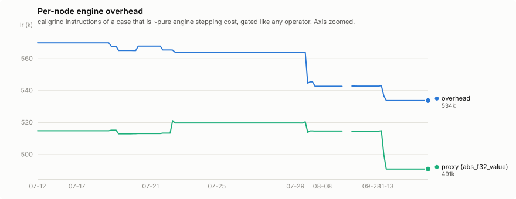
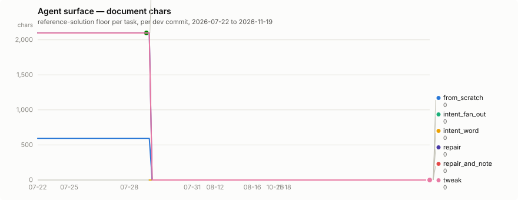

# reuben bench history

Deterministic CI performance trend: callgrind **instruction counts (Ir)** for rendering **1 s of audio** (375 × 128-frame blocks @ 48 kHz), recorded on every direct push to `main`. Instruction counts don't jitter — every visible move is a real code change (or a toolchain bump).

**79 commits** · 2026-06-28 → 2026-11-18 · 4759 data points · last: `0dee305` (2026-11-18T22:29:48-05:00)

*Companion trend: the **dev** series lives on the [`bench-history-dev`](https://github.com/Impractical-Instruments/reuben/tree/bench-history-dev) branch.*

*This page is regenerated by CI on every append — see `.github/scripts/bench-dashboard.py` on `main`. Raw series: [`bench-history.jsonl`](./bench-history.jsonl).*

## Whole-instrument render (macro)

<picture>
  <source media="(prefers-color-scheme: dark)" srcset="charts/macro-dark.svg">
  
</picture>

| Instrument | Latest Ir | vs prev | vs first | since |
|---|---:|---:|---:|---|
| `auto-filter` | 37.4M | ±0.0% | **-37.5%** | 2026-06-28 |
| `autotune` | 35.2M | ±0.0% | **-33.9%** | 2026-06-28 |
| `echo` | 37.6M | ±0.0% | **-34.4%** | 2026-06-28 |
| `reverb` | 44.9M | ±0.0% | **-30.0%** | 2026-06-28 |
| `sampler-arp` | 15.5M | ±0.0% | **-28.0%** | 2026-06-28 |

## Per-node engine overhead

<picture>
  <source media="(prefers-color-scheme: dark)" srcset="charts/overhead-dark.svg">
  
</picture>

`overhead` is a bench-only no-op operator behind a typical port shape, so its entire cost is the engine's per-node stepping overhead (edge clear, routing, materialize, `Io` build — see `bench_support.rs`). The `proxy (abs_f32_value)` line is the cheapest value-rate case — ~99% the same overhead — covering history from before the dedicated case landed; its level differs (a smaller port surface), so the two are separate lines, never stitched. Latest: **534k Ir** ≈ **1,423 instructions per node per block**. This overhead is a constant offset on every micro case and scales with node count in an instrument.

## Graph construction (construct)

<picture>
  <source media="(prefers-color-scheme: dark)" srcset="charts/construct-dark.svg">
  
</picture>

Cost paid **once per Swap**, on the caller's thread — which in the browser is the main thread, so this is tab-freeze time rather than background time. Read the growth table, not the levels: each shape is benched at node counts that double, so a build linear in node count holds at 2.00x while a per-node scan pushes it toward 4.00x. The perf gate fails the run above 2.40x, independently of any baseline.

| Case | Latest Ir | vs prev | vs first | since |
|---|---:|---:|---:|---|
| `deep_n2048` | 55.8M | ±0.0% | ±0.0% | 2026-11-18 |
| `deep_n4096` | 113.1M | ±0.0% | ±0.0% | 2026-11-18 |
| `deep_n8192` | 227.0M | ±0.0% | ±0.0% | 2026-11-18 |
| `nest_n2048` | 41.3M | ±0.0% | ±0.0% | 2026-11-18 |
| `nest_n4096` | 83.9M | ±0.0% | ±0.0% | 2026-11-18 |
| `nest_n8192` | 169.5M | ±0.0% | ±0.0% | 2026-11-18 |
| `wide_n2048` | 45.8M | ±0.0% | ±0.0% | 2026-11-18 |
| `wide_n4096` | 93.1M | ±0.0% | ±0.0% | 2026-11-18 |
| `wide_n8192` | 186.9M | ±0.0% | ±0.0% | 2026-11-18 |

| Shape | Nodes | Latest growth |
|---|---:|---:|
| deep | 2,048 → 4,096 | 2.03x |
| deep | 4,096 → 8,192 | 2.01x |
| nest | 2,048 → 4,096 | 2.03x |
| nest | 4,096 → 8,192 | 2.02x |
| wide | 2,048 → 4,096 | 2.03x |
| wide | 4,096 → 8,192 | 2.01x |

## Heaviest operators (micro)

<picture>
  <source media="(prefers-color-scheme: dark)" srcset="charts/micro-heavy-dark.svg">
  
</picture>

## All cases

Full table — every benched case, latest vs previous and first recording

| Case | Latest Ir | vs prev | vs first | since |
|---|---:|---:|---:|---|
| `macro/auto-filter` | 37.4M | ±0.0% | **-37.5%** | 2026-06-28 |
| `macro/autotune` | 35.2M | ±0.0% | **-33.9%** | 2026-06-28 |
| `macro/echo` | 37.6M | ±0.0% | **-34.4%** | 2026-06-28 |
| `macro/reverb` | 44.9M | ±0.0% | **-30.0%** | 2026-06-28 |
| `macro/sampler-arp` | 15.5M | ±0.0% | **-28.0%** | 2026-06-28 |
| `construct/deep_n2048` | 55.8M | ±0.0% | ±0.0% | 2026-11-18 |
| `construct/deep_n4096` | 113.1M | ±0.0% | ±0.0% | 2026-11-18 |
| `construct/deep_n8192` | 227.0M | ±0.0% | ±0.0% | 2026-11-18 |
| `construct/nest_n2048` | 41.3M | ±0.0% | ±0.0% | 2026-11-18 |
| `construct/nest_n4096` | 83.9M | ±0.0% | ±0.0% | 2026-11-18 |
| `construct/nest_n8192` | 169.5M | ±0.0% | ±0.0% | 2026-11-18 |
| `construct/wide_n2048` | 45.8M | ±0.0% | ±0.0% | 2026-11-18 |
| `construct/wide_n4096` | 93.1M | ±0.0% | ±0.0% | 2026-11-18 |
| `construct/wide_n8192` | 186.9M | ±0.0% | ±0.0% | 2026-11-18 |
| `granulator` | 27.7M | ±0.0% | -2.6% | 2026-06-30 |
| `resonator` | 15.3M | ±0.0% | **-35.7%** | 2026-06-29 |
| `reverb` | 11.0M | ±0.0% | **-12.9%** | 2026-06-28 |
| `compressor` | 8.14M | ±0.0% | **-15.8%** | 2026-07-22 |
| `sample_loop` | 6.77M | ±0.0% | ±0.0% | 2026-11-18 |
| `pan` | 6.08M | ±0.0% | **-10.0%** | 2026-06-28 |
| `sequencer` | 4.76M | ±0.0% | **-3.3%** | 2026-06-28 |
| `saturator` | 4.64M | ±0.0% | **-47.1%** | 2026-07-10 |
| `euclid` | 3.96M | ±0.0% | **-7.0%** | 2026-06-28 |
| `sample` | 3.91M | ±0.0% | **-8.4%** | 2026-06-28 |
| `delay` | 3.68M | ±0.0% | **-36.5%** | 2026-06-28 |
| `lfo` | 2.98M | ±0.0% | **-55.8%** | 2026-06-28 |
| `clock` | 2.71M | ±0.0% | **-38.3%** | 2026-06-28 |
| `oscillator` | 2.56M | ±0.0% | **-39.5%** | 2026-06-28 |
| `modulo_f32_signal` | 2.40M | ±0.0% | **-44.1%** | 2026-06-28 |
| `djfilter` | 2.26M | ±0.0% | **-36.7%** | 2026-06-28 |
| `plucked_string` | 2.21M | ±0.0% | ±0.0% | 2026-11-18 |
| `power_f32_signal` | 2.11M | ±0.0% | **-41.1%** | 2026-06-28 |
| `envelope` | 2.00M | ±0.0% | **-4.7%** | 2026-06-28 |
| `filter` | 1.62M | ±0.0% | **-37.3%** | 2026-06-28 |
| `noise` | 1.52M | ±0.0% | **-8.5%** | 2026-06-28 |
| `strum` | 1.43M | ±0.0% | **-5.9%** | 2026-06-28 |
| `m2s` | 1.06M | ±0.0% | **-12.4%** | 2026-06-28 |
| `integrate_f32_signal` | 1.00M | ±0.0% | **-15.7%** | 2026-06-28 |
| `map_f32_signal` | 995k | ±0.0% | **-78.9%** | 2026-06-28 |
| `clamp_f32_signal` | 788k | ±0.0% | **-73.1%** | 2026-06-28 |
| `round_f32_signal` | 753k | ±0.0% | **-4.0%** | 2026-07-22 |
| `differentiate_f32_signal` | 751k | ±0.0% | **-42.0%** | 2026-06-28 |
| `harmony` | 741k | ±0.0% | **-34.1%** | 2026-06-28 |
| `div_f32_signal` | 715k | ±0.0% | **-68.0%** | 2026-06-28 |
| `mul_f32_signal` | 705k | ±0.0% | **-64.6%** | 2026-06-28 |
| `sub_f32_signal` | 705k | ±0.0% | **-63.7%** | 2026-06-28 |
| `max_f32_signal` | 705k | ±0.0% | **-64.6%** | 2026-06-28 |
| `min_f32_signal` | 705k | ±0.0% | **-64.6%** | 2026-06-28 |
| `add_f32_signal` | 705k | ±0.0% | **-63.7%** | 2026-06-28 |
| `abs_f32_signal` | 699k | ±0.0% | **-41.0%** | 2026-06-28 |
| `negate_f32_signal` | 699k | ±0.0% | **-41.0%** | 2026-06-28 |
| `trunc_f32_signal` | 698k | ±0.0% | **-4.3%** | 2026-07-22 |
| `ceil_f32_signal` | 698k | ±0.0% | **-4.3%** | 2026-07-22 |
| `floor_f32_signal` | 698k | ±0.0% | **-4.3%** | 2026-07-22 |
| `reciprocal_f32_signal` | 663k | ±0.0% | **-53.5%** | 2026-06-28 |
| `map_f32_value` | 601k | ±0.0% | **-13.6%** | 2026-06-28 |
| `output` | 598k | ±0.0% | **-47.3%** | 2026-06-28 |
| `voicer` | 575k | ±0.0% | **-13.3%** | 2026-06-28 |
| `unpack_note` | 572k | ±0.0% | **-4.8%** | 2026-07-22 |
| `overhead` | 534k | ±0.0% | **-20.6%** | 2026-07-05 |
| `clamp_f32_value` | 532k | ±0.0% | **-15.2%** | 2026-06-28 |
| `clamp_i32_value` | 530k | ±0.0% | **-5.2%** | 2026-07-22 |
| `pitch2freq` | 529k | ±0.0% | **-5.4%** | 2026-07-22 |
| `modulo_f32_value` | 526k | ±0.0% | **-15.6%** | 2026-06-28 |
| `power_f32_value` | 521k | ±0.0% | **-15.4%** | 2026-06-28 |
| `modulo_i32_value` | 514k | ±0.0% | **-5.3%** | 2026-07-22 |
| `div_f32_value` | 512k | ±0.0% | **-15.7%** | 2026-06-28 |
| `max_f32_value` | 512k | ±0.0% | **-15.6%** | 2026-06-28 |
| `min_f32_value` | 512k | ±0.0% | **-15.6%** | 2026-06-28 |
| `add_f32_value` | 511k | ±0.0% | **-15.6%** | 2026-06-28 |
| `div_i32_value` | 511k | ±0.0% | **-5.4%** | 2026-07-22 |
| `sub_f32_value` | 511k | ±0.0% | **-15.6%** | 2026-06-28 |
| `mul_f32_value` | 511k | ±0.0% | **-15.6%** | 2026-06-28 |
| `sub_i32_value` | 511k | ±0.0% | **-5.4%** | 2026-07-22 |
| `add_i32_value` | 511k | ±0.0% | **-5.4%** | 2026-07-22 |
| `mul_i32_value` | 510k | ±0.0% | **-5.4%** | 2026-07-22 |
| `max_i32_value` | 510k | ±0.0% | **-5.4%** | 2026-07-22 |
| `min_i32_value` | 510k | ±0.0% | **-5.4%** | 2026-07-22 |
| `snap` | 507k | ±0.0% | **-14.7%** | 2026-06-28 |
| `round_f32_i32_value` | 496k | ±0.0% | **-5.3%** | 2026-07-22 |
| `floor_f32_i32_value` | 494k | ±0.0% | **-5.3%** | 2026-07-22 |
| `trunc_f32_i32_value` | 494k | ±0.0% | **-5.3%** | 2026-07-22 |
| `ceil_f32_i32_value` | 494k | ±0.0% | **-5.3%** | 2026-07-22 |
| `round_f32_value` | 492k | ±0.0% | **-5.5%** | 2026-07-22 |
| `negate_i32_value` | 492k | ±0.0% | **-5.3%** | 2026-07-22 |
| `reciprocal_f32_value` | 492k | ±0.0% | **-16.1%** | 2026-06-28 |
| `abs_f32_value` | 491k | ±0.0% | **-16.0%** | 2026-06-28 |
| `negate_f32_value` | 491k | ±0.0% | **-16.0%** | 2026-06-28 |
| `ceil_f32_value` | 491k | ±0.0% | **-5.5%** | 2026-07-22 |
| `trunc_f32_value` | 491k | ±0.0% | **-5.5%** | 2026-07-22 |
| `floor_f32_value` | 491k | ±0.0% | **-5.5%** | 2026-07-22 |
| `abs_i32_value` | 490k | ±0.0% | **-5.3%** | 2026-07-22 |
| `transpose` | 489k | ±0.0% | **-13.8%** | 2026-06-28 |
| `chord` | 469k | ±0.0% | **-17.2%** | 2026-06-28 |
| `osc_out` | 431k | ±0.0% | **-17.5%** | 2026-06-28 |
| `subpatch` | 400k | ±0.0% | **-22.1%** | 2026-07-01 |

## Agent surface — what authoring costs a model

The deterministic tier of the eval harness: each task's **reference solution** (the ideal call sequence a perfect model would make) replayed against the real MCP sidecar with no inference. So these are the surface's **cost floor**, not any model's score.

<picture>
  <source media="(prefers-color-scheme: dark)" srcset="charts/eval-tokens-dark.svg">
  
</picture>

<picture>
  <source media="(prefers-color-scheme: dark)" srcset="charts/eval-fixed-dark.svg">
  
</picture>

<picture>
  <source media="(prefers-color-scheme: dark)" srcset="charts/eval-payload-dark.svg">
  
</picture>

| Task | Metric | Latest | vs prev | vs first | since |
|---|---|---:|---:|---:|---|
| `from_scratch` | grounding tokens | 19,448 | ±0.0% | +1.9% | 2026-07-28 |
| `from_scratch` | fixed grounding | 19,144 | ±0.0% | +2.0% | 2026-07-28 |
| `from_scratch` | document chars | 0 | — | — | 2026-07-28 |
| `intent_fan_out` | grounding tokens | 19,398 | ±0.0% | +1.9% | 2026-07-28 |
| `intent_fan_out` | fixed grounding | 19,144 | ±0.0% | +2.0% | 2026-07-28 |
| `intent_fan_out` | document chars | 0 | — | — | 2026-07-28 |
| `intent_word` | grounding tokens | 19,260 | ±0.0% | +1.9% | 2026-07-28 |
| `intent_word` | fixed grounding | 19,144 | ±0.0% | +2.0% | 2026-07-28 |
| `intent_word` | document chars | 0 | — | — | 2026-07-28 |
| `repair` | grounding tokens | 19,359 | ±0.0% | +1.9% | 2026-07-28 |
| `repair` | fixed grounding | 19,144 | ±0.0% | +2.0% | 2026-07-28 |
| `repair` | document chars | 0 | — | — | 2026-07-28 |
| `tweak` | grounding tokens | 19,204 | ±0.0% | +2.0% | 2026-07-28 |
| `tweak` | fixed grounding | 19,144 | ±0.0% | +2.0% | 2026-07-28 |
| `tweak` | document chars | 0 | — | — | 2026-07-28 |

- **Fixed grounding** is what every turn of every task pays before the model does anything: the server `instructions` plus every tool schema. It creeps when a tool description or the authoring guide grows, and nothing else watches it.
- **Document chars** is freehand JSON the model had to emit, **echoes included** — a whole-document re-emit for a one-value tweak costs full price here, which is exactly the cost the surface work is chasing.

## Reading notes

- **Bold** deltas exceed the perf gate's 3% warn line.
- Micro cases measure `step_node` — operator DSP **plus** the constant per-node engine overhead above. Cheap (value-rate) cases are therefore dominated by that overhead: a uniform absolute shift across all of them is an engine-overhead change, not operator regressions.
- Construct cases are the one place an absolute level is the *less* interesting number: a change that moves all three sizes of a shape by the same factor is a constant-factor change, while one that moves only the largest is a scaling change, and only the second kind gets worse as songs get bigger.
- A series that starts mid-chart is an operator that landed after recording began; its *vs first* compares against its own first real measurement (registration stubs < 1000 Ir are dropped).
- Gaps are honest: a commit whose bench harness didn't compile against its baseline records nothing.
- Ir is not wall-clock. Counts shift when the pinned toolchain or target baseline changes (e.g. the x86-64-v3 bump on 2026-06-29) — those steps are real cost changes on the same workload, but not source-code regressions/wins.
